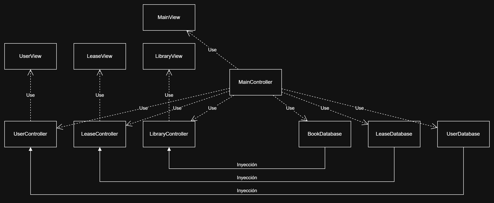

# 📚Sistema de Biblioteca📚

Este proyecto busca simular un sistema de biblioteca que contiene usuarios, libros, ejemplares y préstamos, creado en Java (25).

Proyecto creado en Eclipse IDE.

## 🔩Estructura Model-View-Controller🔩

A la hora de realizar este proyecto aprendí sobre la existencia de la estructura Model-View-Controller.

Busqué un poco por internet, y decidí probar a implementar este proyecto empleando el MVC.



La estructura principal consiste en el controlador central `MainController` que instancia los modelos `BookDatabase`, `LeaseDatabase` y `UserDatabase`; los controladores `UserController`, `LeaseController` y `LibraryController` a los cuales se les inyecta los respectivos modelos. De esta forma, los modelos residen (y tienen el lifetime) en `MainController` pero los controlan los controladores.

En principio pensé en usar un Singleton, pero consideré que la inyección de dependencias es más robusta.

## 🧑‍🎓Mentoría🧑‍🎓

Las preguntas más en concreto está comentadas de la siguiente forma para que sea
fácil de buscar:
```
/**
* TODO Mentoría
* La pregunta en cuestión [...]
*/
```